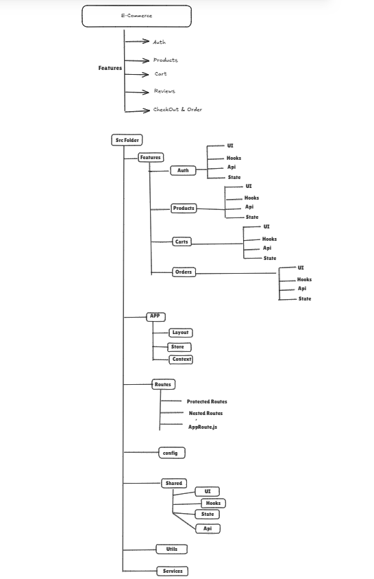

# fronted Architecture
- in frontend we follow 2 architecture
-  - Component based architecture
-  - 4 layer feature based architecture
-  - monorepo architecture

- - example of component based architecture is what everwe follow before
that is component based architecture

- - example of 4 layer feature based architecture is as follows

## 4 layer feature based architecture
1. ** Presentation layer ** (Ui) - This layer is responsible for the UI of the application. It contains all the components that are responsible for rendering the UI and handling user interactions.

2. ** Business logic layer ** - (Hooks) This layer is responsible for handling the business logic of the application. It contains all the services and functions that are responsible for processing data and making decisions based on user input.

3. ** Data fetching/managing layer ** - (Api) This layer is responsible for fetching and managing data from external sources. It contains all the functions that are responsible for making API calls and handling responses.

4. ** State managing layer ** - (state/Redux) This layer is responsible for managing the state of the application. It contains all the functions that are responsible for updating the state and notifying the UI of any changes.

## understanding what thing comes under which layer
- ** Presentation layer ** (Ui)  - components, pages, containers, layout, ui-kit, etc

- ** Business logic layer ** - (Hooks) - hooks, services, utils, helpers, etc

- ** Data fetching/managing layer ** - (Api) - api, services, utils, helpers, etc (backend api)

- ** State managing layer ** - (state/Redux) - redux(GSM) , context, state management libraries, etc

## understanding with example of E-commerce application

<!-- *  redux thunk -->

# redux thunk
- redux thunk is a outer action for syncing with state to handel the promise state

- - UI -> jab ui se state ko update karna ho to hum reducer kaa use karege 
- - UI -> jab ui se action ko sirf call karna ho to hum thunk kaa use karege